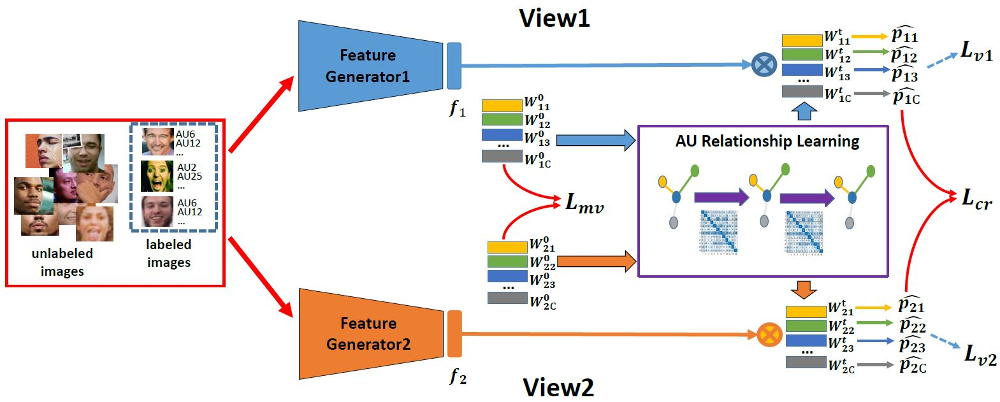

# MLCR

This is the source code for paper 

"Multi-label Co-regularization for Semi-supervised Facial Action Unit Recognition."  
[Xuesong Niu](https://nxsedson.github.io/), Hu Han, Shiguang Shan, Xilin Chen  
NeurIPS 2019  

{:width = '200px', height = '100px'}

## Environment requirest

This code is based on Python 2.7, Pytorch 0.4.1 and CUDA 8.0.

## Database and testing protocol
For EmotioNet database, please refer to [this link](http://cbcsl.ece.ohio-state.edu/dbform_emotionet.html). Please note that we are only able to download 20,722 manually-labeled face images. We randomly choose 15,000 images as the labeled training set, and the other manually-labeled images are used for testing. We perform the testing three times and report the average performance. Please refer to our paper for more information.

For BP4D database, please refer to [this link](http://www.cs.binghamton.edu/~lijun/Research/3DFE/3DFE_Analysis.html). We conduct a subject-exclusive 3-fold cross-validation. The unlabeled training images used for experiments on BP4D are taken from the EmotioNet database.

## Pre-processing 

All the faces are detected and aligned using the [SeetaFace Engineer](https://github.com/seetaface/SeetaFaceEngine).

## Provided model

We provided a model trained on EmotioNet for one testing. You can test it using 'main.py'. The results of this model may be silghtly different from the results in our paper because we reported the average performance of the three testing. You can use it as a pre-trained  model for your task.

## Things may be useful for you
### loss 
### data loader
### network

